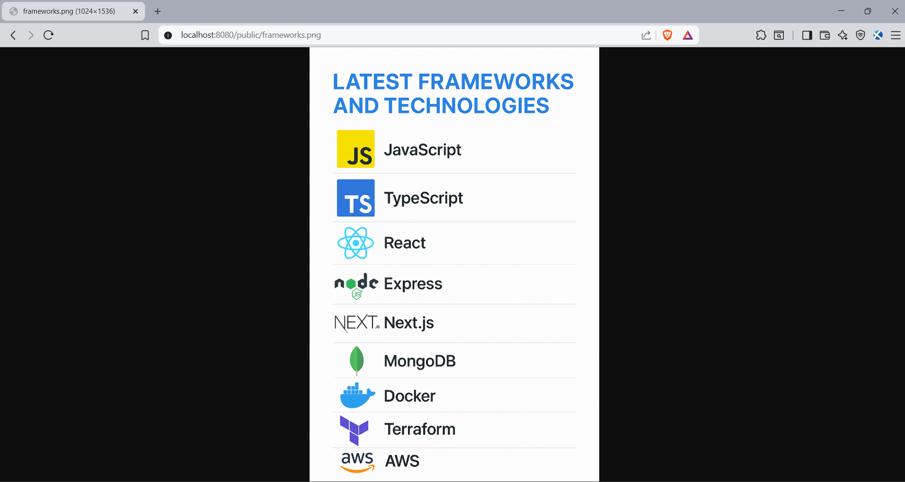
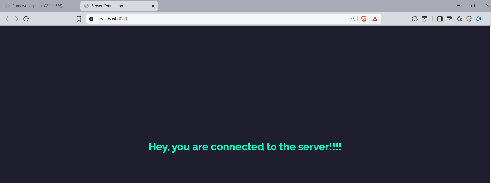
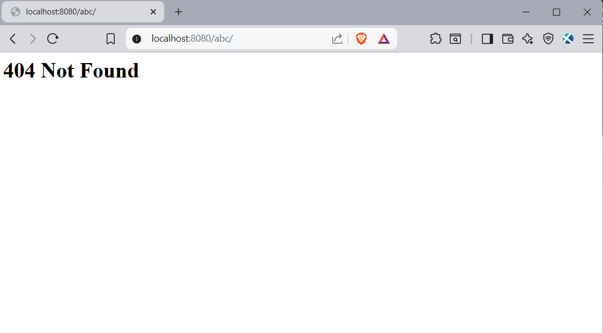

# HTTP Server with Epoll

A high-performance HTTP server implemented in C using Linux's **epoll** interface for scalable I/O event handling. It is designed to serve static files securely and efficiently.

---

## 🔧 Features

- **⚡ Epoll-based Concurrency**
  - Uses **edge-triggered** epoll for efficient handling of multiple connections
  - Non-blocking sockets with a 15-second epoll timeout

- **📁 Static File Serving**
  - Supports serving `.html`, `.txt`, `.pdf`, `.jpg`, `.png`, and `.svg` files
  - Automatically detects and sends proper MIME types

- **🛡️ Security Measures**
  - Protects against **directory traversal** (blocks `../` patterns)
  - Validates all HTTP input before processing

- **📜 Comprehensive Logging**
  - Logs include timestamps and levels: `DEBUG`, `INFO`, `WARN`, `ERROR`
  - Persistent logs stored in `server.log` for audit and debugging

- **📡 HTTP Compliance**
  - Supports `GET` method
  - Handles:
    - `200 OK`
    - `400 Bad Request`
    - `404 Not Found`

---

## 📂 Directory Structure

```
├── public/      // Web content directory
│ ├── index.html   // Default homepage
│ └── ... // Additional static files
├── server // Compiled server executable
├── server.log // Log file (generated at runtime)
├── server.c // Main server logic
├── http.c // HTTP parsing and response handling
├── http.h // HTTP protocol definitions
├── logger.c // Logging implementation
└── logger.h // Logging interface
```

---

## 🛠️ Build & Run

### 1. Compile all source files
```bash
gcc logger.c http.c server.c -o httpserver
```

### 2. Run the server (default port: 8080)
```bash
./httpserver
```

### 3. Open the browser or run 
```bash
curl http://localhost:8080/
```
```
http://localhost:8080/frameworks.png
```

---
## 🌐 Accessing Content

| URL Pattern         | Served File            |
|---------------------|------------------------|
| `/`                 | `public/index.html`    |
| `/file`             | `public/file`          |
| `/images/logo.png`  | `public/images/logo.png` |
| `/public/file`      | `public/file`          |

---

## 📝 Logging Examples

```log
[2025-07-10 14:30:00] INFO: New connection from 127.0.0.1
[2025-07-10 14:30:05] DEBUG: Mapped resource to path: public/style.css
[2025-07-10 14:30:05] INFO: 200 OK - Served: public/style.css (342 bytes)
[2025-07-10 14:30:10] WARN: Potential directory traversal attempt: /../secret.txt
```
---
## 💻 Screenshots
###Client Output




###Server Output


---

## 📄 License

This project is licensed under the [MIT License](https://opensource.org/licenses/MIT).


